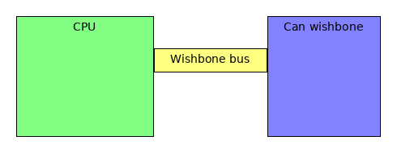

Can Wishbone
============

The can controller has a wishbone compabile interface implemented in the can_wb.vhd interface. 
This interfaces allows to configure,send and receive can messages from a soft core.

Register overview
'''''''''''''''''

.. list-table:: Register list
   :widths: 15 10 30 40
   :header-rows: 1

   * - Register name.
     - Register address.
     - R/W.
     - Description.
   * - REG_VERSION
     - 0x00000000
     - RO
     - Version inforation
   * - REG_STATUS
     - 0x00000001
     - RO
     - Status register
   * - REG_CONF
     - 0x00000002
     - R/W
     - Configuration register
   * - REG_SAMPLE_RATE
     - 0x00000003
     - R/W
     - Sample rate control
   * - REG_ID_FILTER
     - 0x00000004
     - R/W
     - ID filter control
   * - REG_ID_FILTER_MASK
     - 0x00000005
     - R/W
     - ID filter mask control
   * - REG_TX_ID
     - 0x00000006
     - R/W
     - Transmit ID register
   * - REG_TX_DLC
     - 0x00000007
     - R/W
     - Transmit Data length
   * - REG_TX_DATA0
     - 0x00000008
     - R/W
     - Transmit data low word
   * - REG_TX_DATA1
     - 0x00000009
     - R/W
     - Transmist data high word
   * - REG_TX_VALID
     - 0x0000000a
     - R/W
     - Set Transmit registers validity
   * - REG_RX_ID
     - 0x0000000b
     - R/W
     - Receiver ID register
   * - REG_RX_DLC
     - 0x0000000c
     - R/W
     - Reciever data length register
   * - REG_RX_DATA0
     - 0x0000000d
     - R/W
     - Reciever data low word
   * - REG_RX_DATA1
     - 0x0000000e
     - R/W
     - Receiver data high word
   * - REG_RX_DRR
     - 0x0000000f
     - R/W
     - Receiver data read ready status

Register description
''''''''''''''''''''

Here you will find a description of the registers but to be sure ..
`use the source <https://github.com/keesj/can-hdl/blob/master/hdl/can/syn/can_wb.vhd#L74>`_

REG_VERSION
-----------
 
Can controller version `reads h"13371337' <https://github.com/keesj/can-hdl/blob/master/hdl/can/syn/can_wb.vhd#L33>`_

REG_STATUS
----------
code: `source <https://github.com/keesj/can-hdl/blob/master/hdl/can/syn/can.vhd#L67>`_
Status register 

.. list-table:: Bit values
  :widths: 15 20
  :header-rows: 1

  * - BIT
    - Description
  * - 0
    - rx status 0 = idle , 1 = busy
  * - 1 
    - tx status 0 = idle , 1 = busy 
  * - 2
    - rx crc error
  * - 3
    - rx data ready
  * - 4 
    - tx lost artibration error

REG_CONF
--------

(loopback,selftest )

REG_SAMPLE_RATE
---------------

REG_ID_FILTER
-------------

REG_ID_FILTER_MASK
------------------

REG_TX_ID
---------

tx_id (11 msb are id) and lsb is request response

REG_TX_DLC
----------

REG_TX_DATA0
------------

REG_TX_DATA1
------------

REG_TX_VALID
------------

REG_RX_ID
---------

tx_id (11 msb are id) and lsb is request response

REG_RX_DLC
----------

REG_RX_DATA0
------------

REG_RX_DATA1
------------

REG_RX_DRR
----------

(the data has been read)

