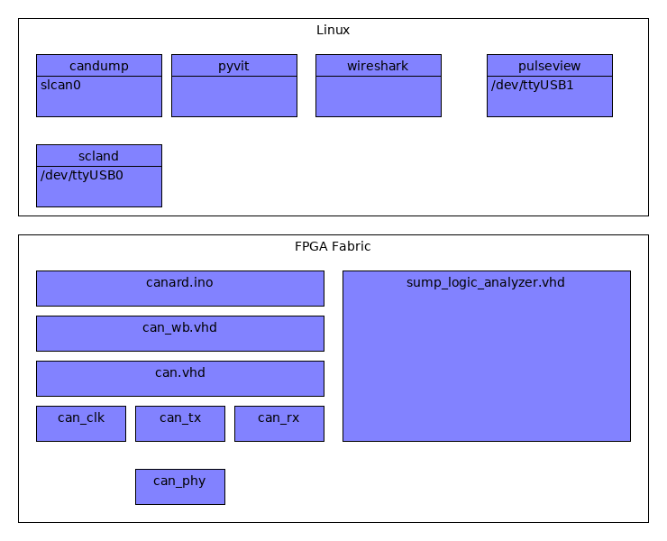

Design overview
===============

The following image shows a high level overview of the current stack.

Software stack overview
-----------------------

Can HDL is only a small piece of the puzzle to get a fully working system and the linux Software stack was not developed by me. The goal of the project is/was to have more flexibility in the lower layers to be able to implement different type of attacks and triggering.

VHDL overview
-------------

can_phy.vhd
'''''''''''

Unlike something like an UART on the CAN bus multiple devices can drive the lines. The same lines are also used for send and receive. The overall design is that the lines have a "dormant" state of 1 and anybody on the bus can drive the lines to the "0" level.

To be able to implement this it was not enough to driver 0 or 1 out of the lines but also an "enable" was required. 

Not only that but the protocol prevents collisions of packets by giving packets with a lower id (That thus drive the lines low) priotiry. In terms of implementation it is therefore required to be able to detect when you are sending a 1 but the line becomes a 0 (you lost arbitration). 

can_tx.vhd
''''''''''

There are different standards for can packect length. I focused on the ones that have 11 bit id's. Can tx accepts an id a data lenght and data and is able to drive the can_phy to send out a full packet (including things like the above arbitration and performing the calculation of the crc).

can_rx.vhd
''''''''''

Pertty much the same as can_tx but for the reveiving end

can.vhd
'''''''

Wrapper for all the components related to this projects.

can_crc.vhd
'''''''''''

Used in can_rx and can_tx to calculate the CRC of the packets (one bit at the time)

can_tx_mux.vhd
''''''''''''''

I expected the can_tx to be doing the sending and can_rx the receiving but things are not that simple. Almost at the end of sending a can packet a 1 bit wide acknowledge slot is left "dormant". It is up to the receivers (rx) to drive the lines at that time if the packets.. was for the desgigned receiver and the crc matched. Can mux allows both the TX and RX part to drive the tx lines.

can_clk.vhd
'''''''''''

Can clk can use a little move love but the main purpose is to generate clock events for the can bus. a bit time is divided in 10 (quanta). At time 0 the bits can be set. At time 7 the bits are to be read.

Can clock also synchronizes with the clock edges on incomming bit.(A test testing this is called can_two_devices_clk_sync_tb.

can_wb.vhd
''''''''''

This interface provides a way to interact with the code using the wishbone interface. This is there registers are defined.

