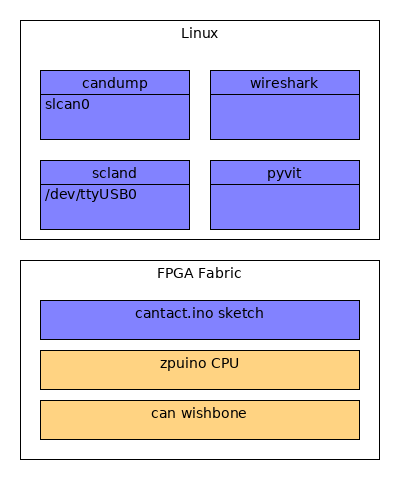
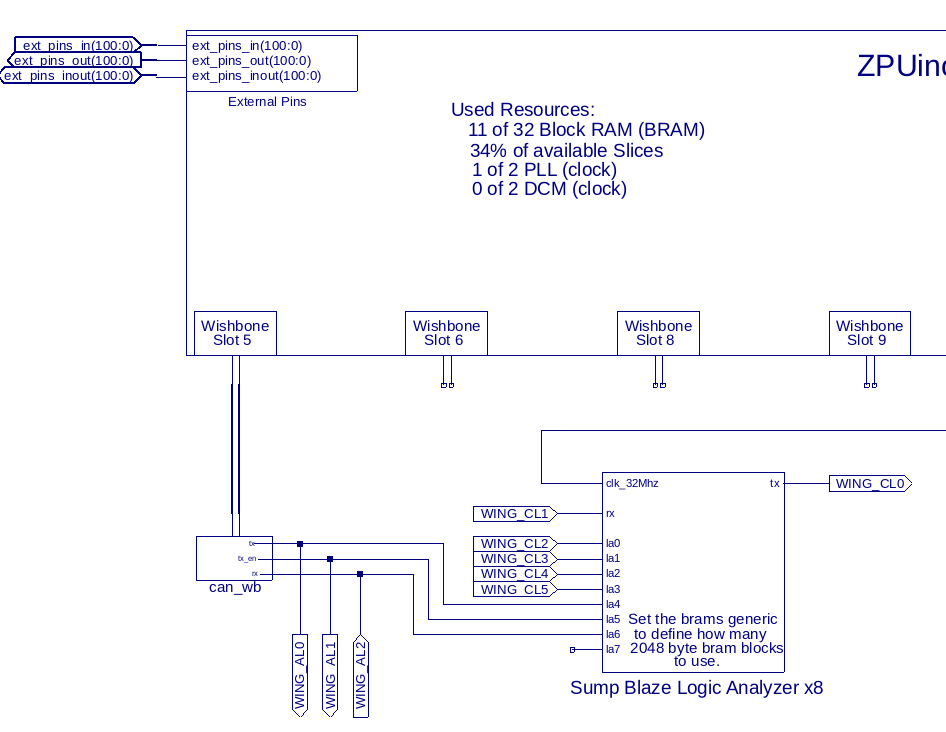
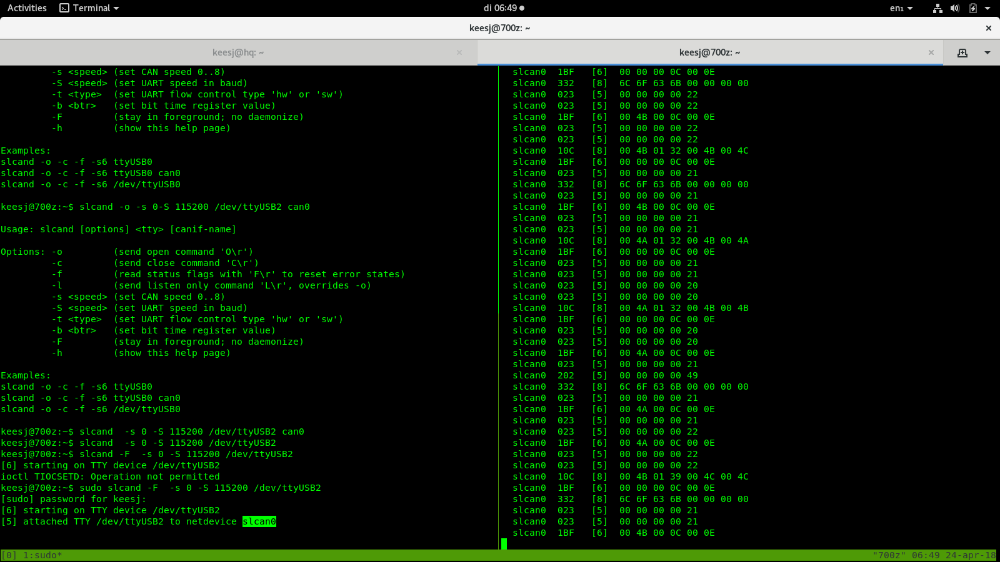
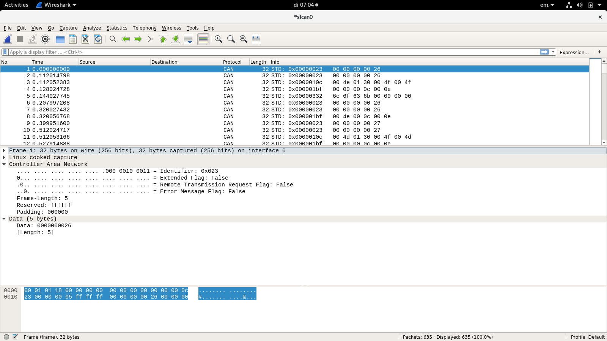

Linux support
=============

Linux is supported by means of the linu can stack inclucing sclan.

On the hardware/FPGA side we run a sketch on the can-enabled ZPUino

Papilio pro setup
'''''''''''''''''

After installing DesignLab copy or links the DesignLab/libraries/can_wb to the 
libraries fanolder of DesignLab. 

Next open Desiglab and select the can_wb/cantact sketch. Program the FPGA and upload the sketch.

The schematics setup looks like this

Linux setup
'''''''''''

Start slcand from can-utils

    sudo slcand -F  -s 0 -S 115200 /dev/ttyUSB1

Bring up the slcan0 interface.

    sudo ip link set up slcan0

Candump
'''''''

One can dump the can frames using

    candump slcan0

Wireshark
'''''''''

I also found wireshark to work on this

'''''''

