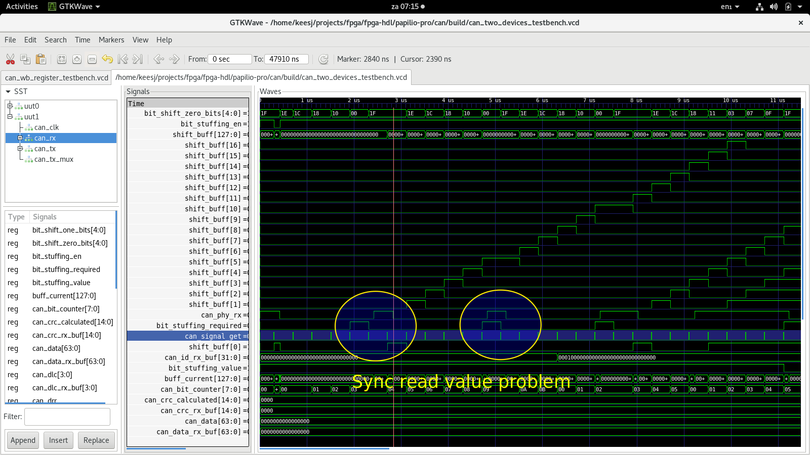
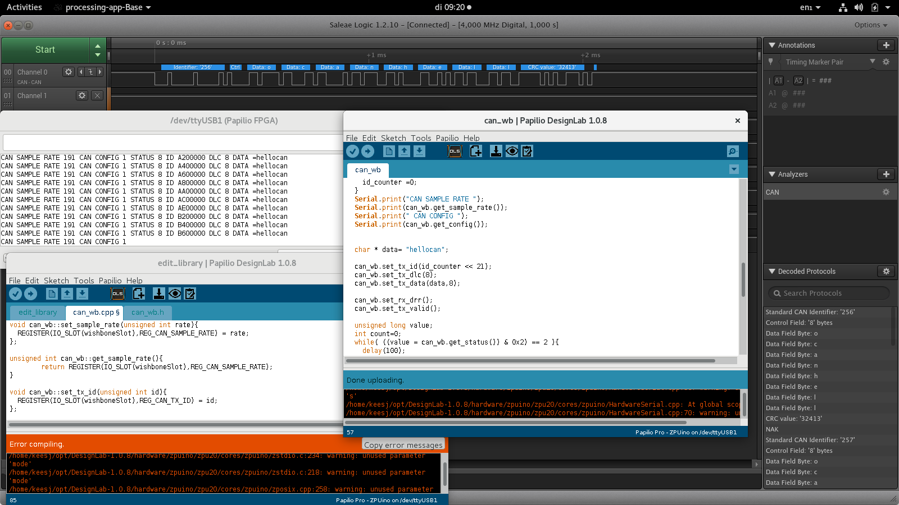
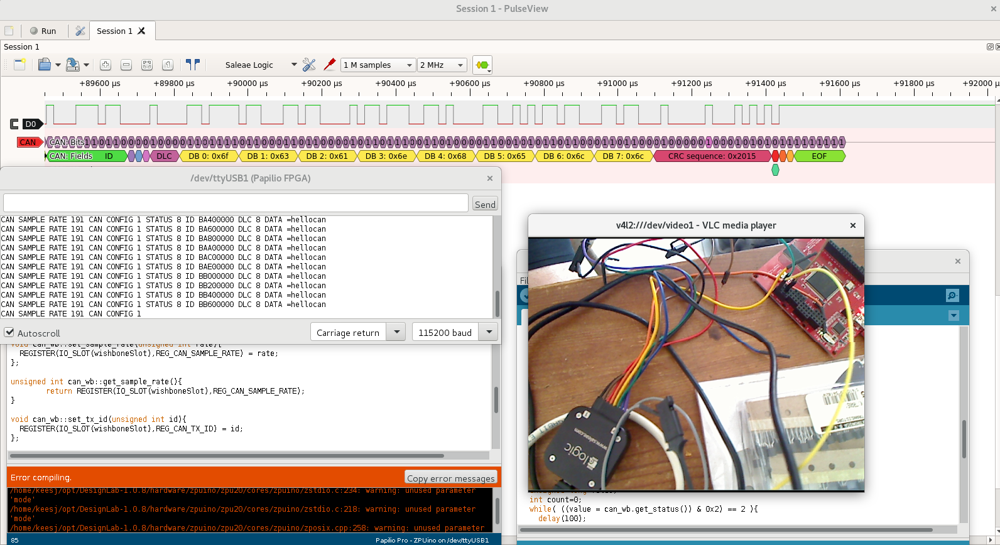
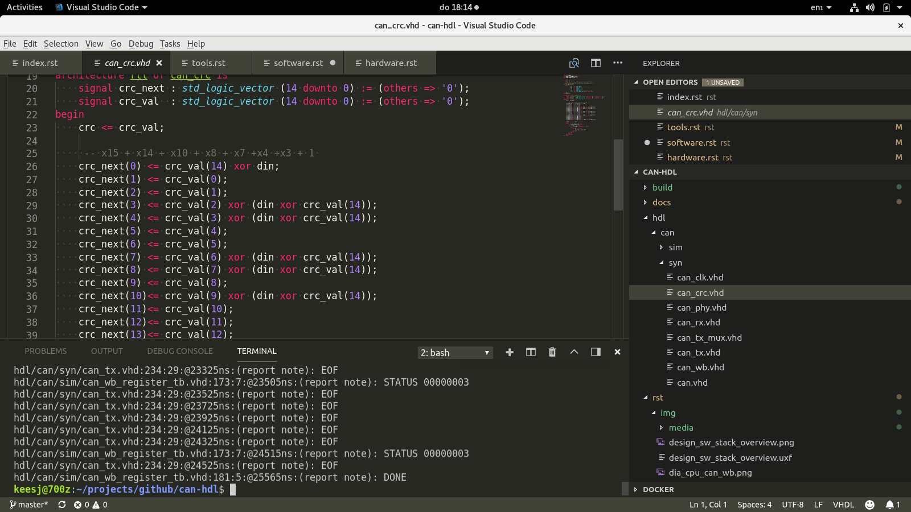
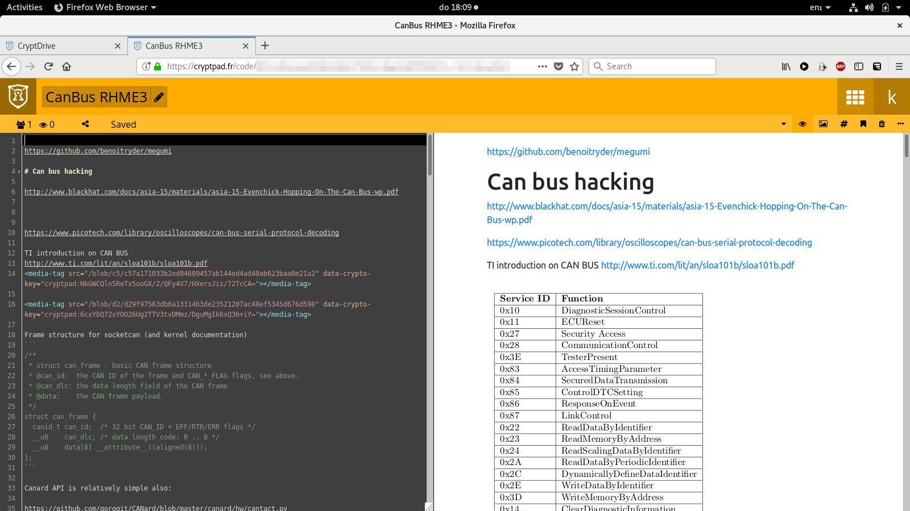

Tools
=====

During the development of this module I used a few tools.

GHDL
''''

The GHDL VHDL 2008/93/87 simulator https://github.com/ghdl/ghdl was essential for this project. The quality was nice, reported errors where soon fixed and compiling
tool seconds v.s. editing and compiling in the Xilinx tools.

The documentation can be found here https://ghdl.readthedocs.io/en/latest/

If anything this is the tool to checkout!

GTKWave
'''''''

GTKWave was used to look at waveforms generated by simulation and to verify what was going on http://gtkwave.sourceforge.net/. At the start I only used the waveform viewer
to to do development but soon discovered that I needed to write unit tests that pass or fail if I wanted to succeed in this project

DesignLab
'''''''''

DesignLab is an IDE desgined by the gadgetfactory. It combines an Ardunino IDE to program the ZPUino soft core with Xilinx ISE webpack to to visually attach device to the softcore or write your own programs. DesignLab also allow to programt the board I was using (papilio pro).

Sigrok
''''''

Sigrok offered the CAN logic analyzer features I wanted for the project. The older code on my (non bionic) Ubuntu install was a bit outdated but more recents
builds did offer better support.
https://sigrok.org/

Visual Studio Code
''''''''''''''''''

I have been using Visual Studio code lately (after years of vim) and found some piece of mind escaping the edit/compile/fix cycle.
https://code.visualstudio.com/ and a plugin that helps a little with editing VHDL https://www.vhdltool.com/.

cryptpad.org
''''''''''''

Cryptpad allows hassle free editing and pasting of images onto a secure environment.

