Tutorial
========

Can
--- 

Can Signaling
'''''''''''''

* Differential

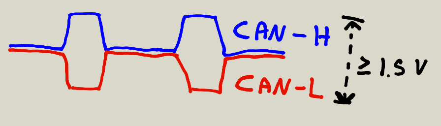

* High transmision(the default state) is recessive (hang loose)

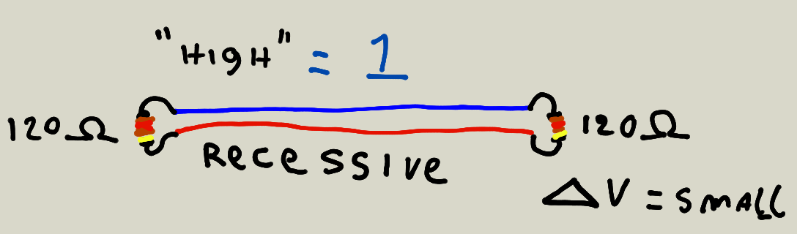

* Low transmission is dominant (driven)

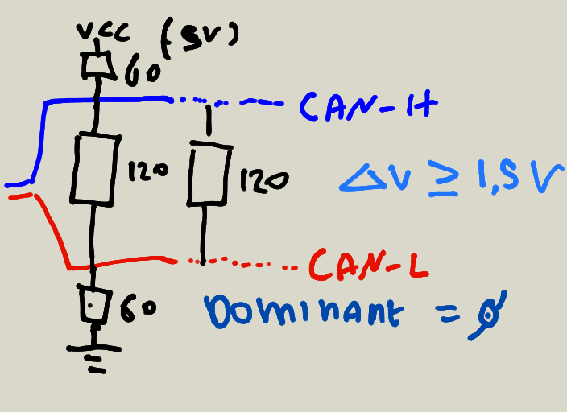

* Ended with 120 Ohm resistors
* No dedicated TX/RX like on an UART
* No separate clock line like on SPI/JTAG/I2C
* 0 is STRONGER than 1

Can topology
''''''''''''

* Star topology (and others)

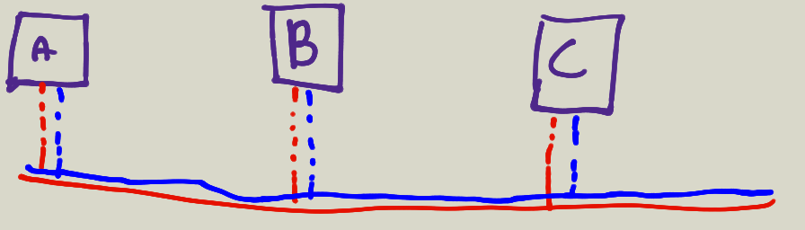

Can frame
'''''''''

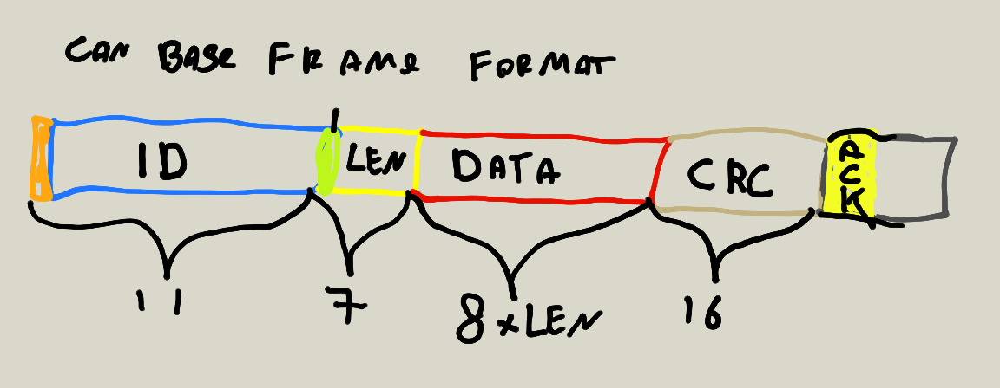

Can arbitration
''''''''''''''''

* Prevent collision during arbitration (when I send a recessive bit but "see" a dominant one, I shut up)
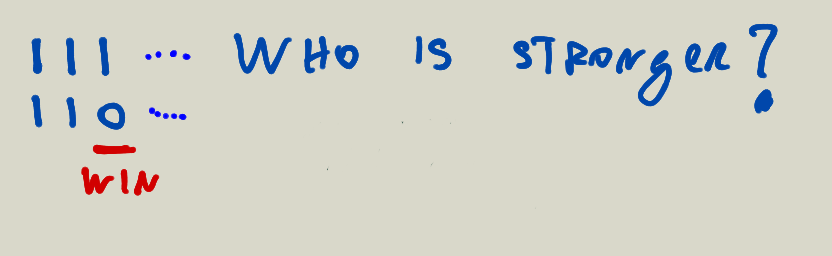

Can bit stuffing
''''''''''''''''

* Prevent 6 concecutive bits from having the same value

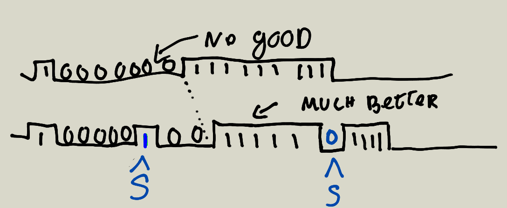

Can crc
'''''''

* Can frame are guarded by a CRC

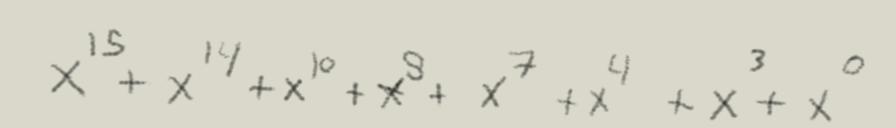

Can protocol
''''''''''''

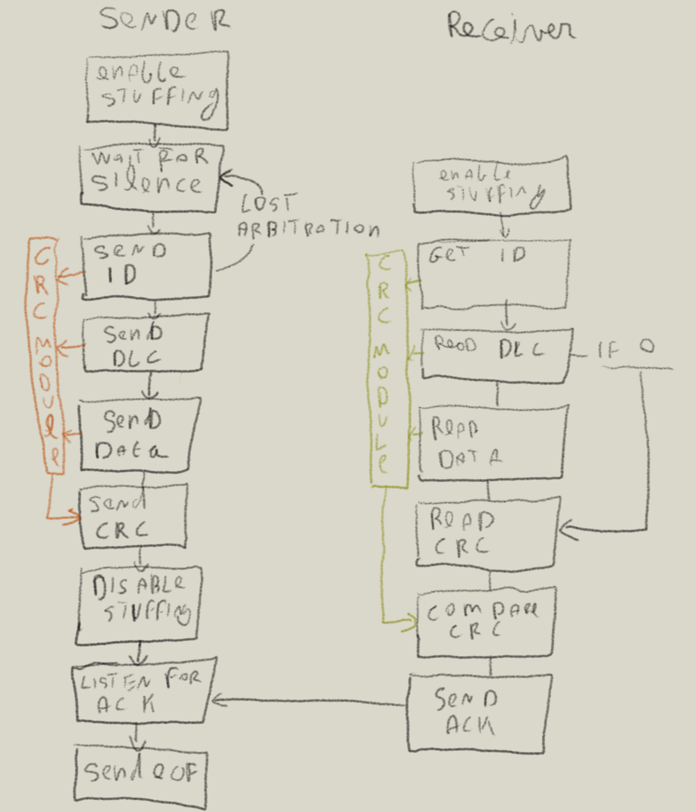

Summary
'''''''

* Can is different from average UART/SPI/JTAG
* Supports multiple devices on the same bus
* Has arbitration and crc's to provide reliable delivery and priorities
* Has quite hard requirements in terms of timing (e.g. the ack bit and lack of clock)

Components
----------

Accessing the can bus therefore calls for the following Components

* A can phy (that converts a logic signal into something valid with the can specs)
* A controller (that has strict timing and basic logic to offload the CPU)
* Logic (e.g. a program telling to send or receive frames and configuring the controller)

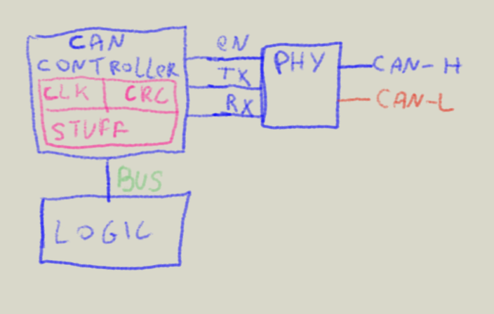

For hackers we want more

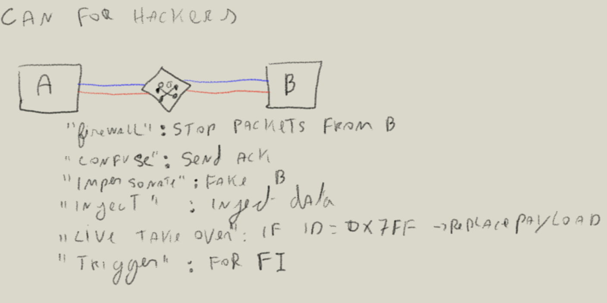

The design for a flexible controller calls for at least two phys (possibly 3) and the ability
to trigger an interact on every state change on the can bus.

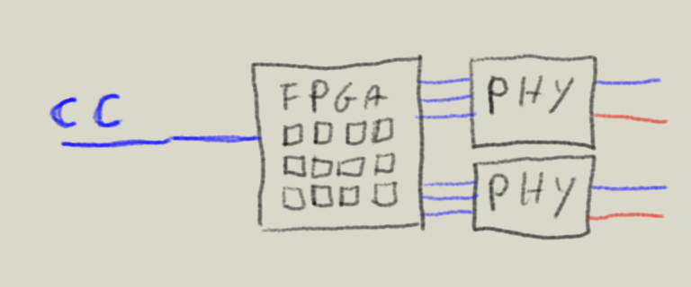

HDL
---

FPGA architecture
'''''''''''''''''

Mostly based on the fosdem presentation from Tristan Ginggold 
https://fosdem.org/2018/schedule/event/cad_fpga_intro/attachments/slides/2136/export/events/attachments/cad_fpga_intro/slides/2136/fpga_design.pdf