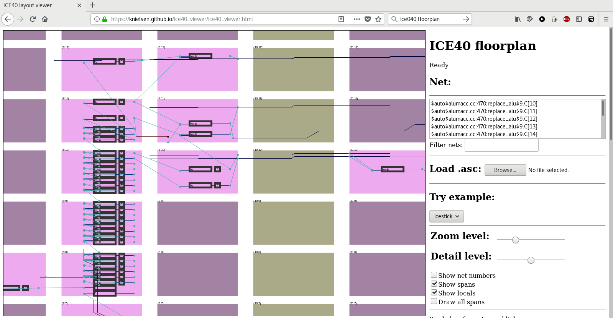

Tutorial
========

The challenge
-------------

The challenge:

"Our operatives have recovered a DeLorean in the ruins of an old mid-west US town. It appears to be locked, but we have successfully accessed its internal communications channels. According to the little data we have, the DeLorean internally uses an archaic technology called CAN bus. We need you to analyze the communications and find a way to unlock the vehicle; once unlocked, recover the secret flag stored inside. We have reason to believe that vehicle entry should be a fairly easy challenge, but to aid you in this, we have restored and reconnected the vehicle dashboard."

About Can
---------

Can Signaling
'''''''''''''

* Differential

.. image:: tutorial/can_h_can_l.svg

* High transmision(the default state) is recessive (hang loose)

* Low transmission is dominant (driven)

* Ended with 120 Ohm resistors
* No dedicated TX/RX like on an UART
* No separate clock line like on SPI/JTAG/I2C
* 0 is STRONGER than 1

Can topology
''''''''''''

* Star topology (and others)

.. image:: tutorial/can_topology.png

Can frame
'''''''''

.. image:: tutorial/can_base_frame.png

Can arbitration
''''''''''''''''

* Prevent collision during arbitration (when I send a recessive bit but "see" a dominant one, I shut up)

.. image:: tutorial/can_arbitration.png

Can bit stuffing
''''''''''''''''

* Prevent 6 concecutive bits from having the same value

Can crc
'''''''

* Can frame are guarded by a CRC

.. image:: tutorial/can_crc.png

Can protocol
''''''''''''

Can Summary
'''''''''''

* Can is different from average UART/SPI/JTAG
* Supports multiple devices on the same bus
* Has arbitration and crc's to provide reliable delivery and priorities
* Has quite hard requirements in terms of timing (e.g. the ack bit and lack of clock). This is because the logic depends on the recieved data

For the challenge
------------------

Accessing the can bus calls for the following Components

* A can phy (that converts a logic signal into something valid with the can specs)
* A controller (that has strict timing and basic logic to offload the CPU)
* Logic (e.g. a program telling to send or receive frames and configuring the controller)

.. image:: tutorial/can_controller_and_phy.png

For hackers we want more

* Firewall: Functionality to filters out "unwanted" stuffing
* Confuse: send inaproritate ack requests, cause miscommunication
* Impersonation tools e.g. record/replay recieved packets
* Inject: Inject data put data on the bus
* Live take over: When device B sends ID 0xf77 take over the payload
* Triggers: Allow good triggers to perform fault injections

.. image:: tutorial/can_for_hackers.png

* Ordering hardware http://canable.io/ failed and it felt like a nice challenge to implement my own can controller and phy
* I was in no hurry so started coding

HDL
---

Using an FPGA was a good match. 

FPGA architecture
'''''''''''''''''

From the hardware side of things
LUT, Buffers, and inteconnects

* Look Up Tables

* Buffers. keep value

.. image:: tutorial/fpga_buffer.png

* Interconnects

Example final floorplan  (Configuration loaded from memory/flash)

`online viewer <https://knielsen.github.io/ice40_viewer/ice40_viewer.html>`_

* Combined these logic blocks you can create real functionality from a simple controller to a full(but slowish) system on chip

FPGA toolchain
''''''''''''''

A full toolchain does eventhing from the high level code until creating a bitstream that can be loaded in the fpga.

VHDL
----

The design for a flexible controller calls for at least two phys (possibly 3) and the ability
to trigger an interact on every state change on the can bus.

I used VHDL as language of choice because I have a papilio board and the examples are using VHDL.

.. image:: tutorial/can_fpga.png

Simple logic
'''''''''''''

The phy contains simple boolean logic (nothing is sequential)

.. literalinclude:: ../hdl/can/syn/can_phy.vhd
    :linenos:
    :emphasize-lines: 20

Stats
-----

Generated using gitstats on `my working repository <https://github.com/keesj/fpga-hdl/tree/can>`_

